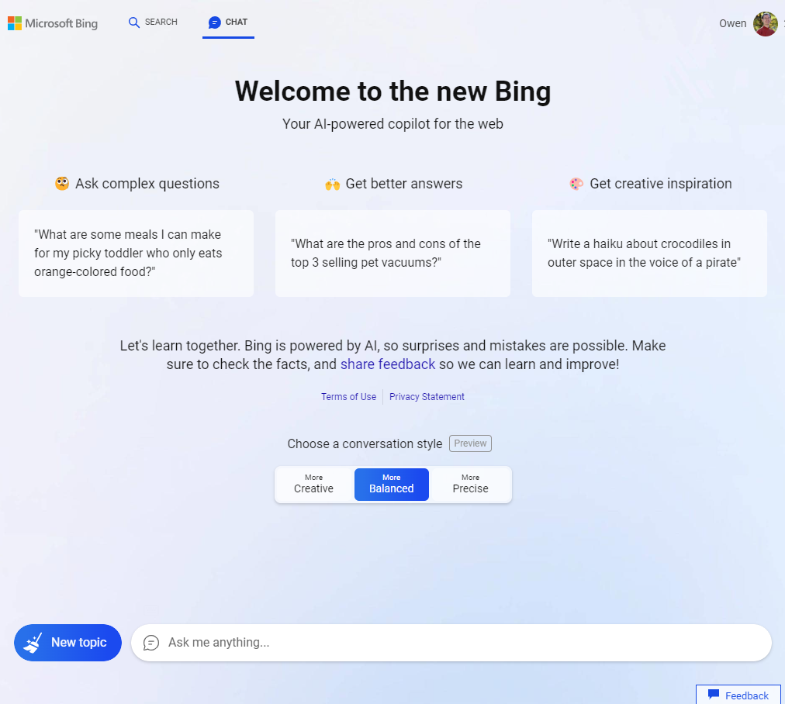
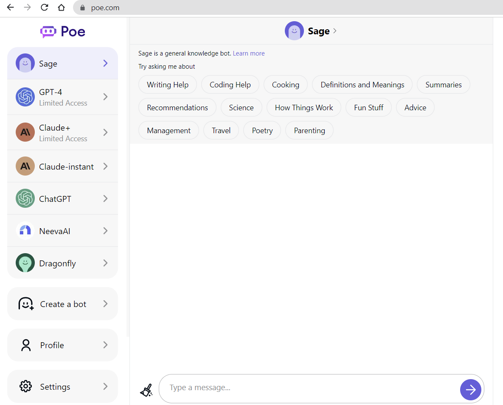
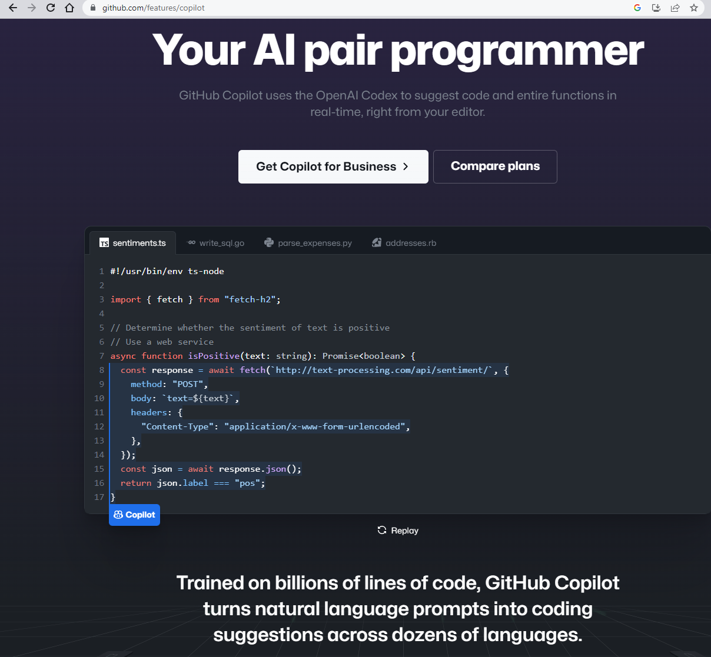

### [ChatGPT Guide](./README.md)

One ChatGPT Guide that you will only need for links and resources on ChatGPT and other large language models. This guide is curated by Dr. Owen Chen.

# ChatGPT Alternatives

## [Microsoft Bing Chat](https://www.bing.com/chat)
Microsoft Bing Chat is an AI chatbot experience from Microsoft based on the popular ChatGPT (version 4) Large Language Model (LLM) from OpenAI to offer similar responses to how humans will answer questions.

Although ChatGPT plays a key role in the platform, Microsoft has also created a technology known as Prometheus that allows the chatbot to connect with the Bing search engine to generate safer, faster, and more accurate answers to simple and complex questions about virtually any topic and current events. 
]

## [Bard by Google](https://bard.google.com/)

Bard is Google's answer to OpenAI's ChatGPT. It is a large language model trained on a massive amount of text data, and I am able to communicate and generate human-like text in response to a wide range of prompts and questions. For example, I can provide summaries of factual topics or create stories.

Here are some of Bard's capabilities:

- answer questions in an informative way, even if they are open ended, challenging, or strange.

- generate different creative text formats of text content, like poems, code, scripts, musical pieces, email, letters, etc.

- translate languages.
- write different kinds of creative content.
- help programming and software development tasks, including code generation, debugging and code explanation.
- assist writing functions for Google Sheets.
- explain code snippets.
- simplify complex topics.
- be an outlet for creativity, and a launchpad for curiosity.

## [Claude by Anthropic](https://www.anthropic.com/product)

Currently there are two Claude LLMs:

- Claude-instant tends to be better at many creative writing tasks and tends to give longer and more in-depth answers. Compared to the previously available Claude, Claude-instant is faster and significantly better at non-English languages.

- Claude+ is significantly better than Claude-instant at complex and difficult tasks. Similar to Claude-Instant, it is particularly strong at creative writing and providing detailed responses.
Sage and ChatGPT tend to be better at languages other than English, and are better at programming-related tasks.

## [Dragonfly](https://dragonflyai.co/)

Dragonfly AI is a predictive analytics platform designed to help improving the quality and effectiveness of creative contents.  Dragonfly is powered by OpenAI’s davinci model, which was part of the GPT-3 LLM. 

Dragonfly tends to have shorter responses, and it can be easier to get Dragonfly to follow instructions when given examples in the input.

## [Poe](https://poe.com/)
Poe isn’t one alternative to ChatGPT — it’s several. The app was designed by Quora, the popular question-and-answer website, and it combines seven AI chatbots into one user interface.
]

## [GitHub CoPilot](https://github.com/features/copilot)
GitHub Copilot uses the OpenAI Codex to suggest code and entire functions in real-time, right from an editor.

]

## [ChatGPT Guide](./README.md)
### [What is ChatGPT and How to get started?](./intro.md)
### [Coding with ChatGPT](./code.md)
### [ChatGPT FAQs](./faq.md)
### [ChatGPT News](./news.md)
### [ChatGPT Prompt Templates](./prompts.md)
### [ChatGPT Technical Guide](./techguide.md)
### [ChatGPT Resources](./resources.md)
### [ChatGPT Alterantives](./alternatives.md)
### [ChatGPT Papers](./papers.md)

### [License: MIT License](LICENSE)

### Last Updated by: Owen Chen, Ph.D.
### Date: April 25, 2023