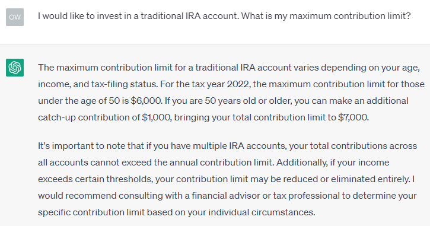

# [ChatGPT Guide](./README.md)

One ChatGPT Guide that you will only need for links and resources on ChatGPT and other large language models.
This guide is curated by Dr. Owen Chen from other resources.

# ChatGPT Prompt Template Guide

Prompt engineering on ChatGPT or other LLMs refers to the process of creating effective prompts that can help to guide the language model in generating high-quality responses. 
Here are some best practices for writing prompts for ChatGPT and other large language models (LLMs).  

* **Understand the task**: Before creating prompts, it's important to have a clear understanding of the task that you want ChatGPT to perform. This includes understanding the type of response that you're looking for, as well as any specific requirements or constraints that may apply.

* **Be clear and concise**: The prompt should be clear and easy to understand. Avoid using jargon or technical terms that LLMs may not be familiar with.

* **Be specific**: The more specific the prompt, the more likely LLMs will generate a good response. Avoid vague or ambiguous prompts. Be as specific as possible about what you're looking for, including any specific details or requirements that may be relevant to the task. For example, instead of asking the LLM to "write a poem," ask it to "write a poem about love."

* **Provide a context**: Context is important for helping ChatGPT to generate high-quality responses. Provide as much context as possible in your prompts, including any relevant background information, key terms or concepts, and any other information that may help to guide the response.

* **Give few-shot examples**: If you can, provide examples of the type of response you are looking for. This technique known as "few-shot" training and this will greatly help the model to understand what you are trying to achieve.  This "few-shot" training also known as "priming".

* **Identify the target audience**: Consider who the target audience is for your prompts. This can help you to tailor your prompts to their specific needs and interests, and can help to ensure that the generated responses are relevant and useful.  Ask ChatGPT to speak in a language and a tone of the target audience.

* **Use natural language**: When creating prompts, use natural language that is easy for humans to understand. This can help to ensure that the prompts are clear and concise, and can help to avoid confusion or misinterpretation.

* **Use keywords**: The prompt should include keywords that are relevant to the desired response. For example, if you want the model to generate a creative text, you could include keywords like "story," "poem," or "script.".  

* **Use positive language**: The prompt should be positive and encouraging. Avoid using negative language or language that is likely to confuse the model.

* **Use a variety of prompts**: Don't just use the same prompt over and over again. The more variety you have in your prompts, the more likely the model is to generate different and interesting responses.

* **Test and refine**: Once you have written a prompt, try it out on the model to see if it generates the desired response. If it doesn't, you may need to revise the prompt. This may involve testing the prompts with a small group of users, or running multiple iterations of the prompts to see which ones generate the best responses.

* **Be patient.**: It may take some time for the model to learn how to generate the type of response you are looking for. Don't give up if you don't get the desired response right away.

* **Have fun!**: Writing prompts for large language models can be a lot of fun. Experiment with different prompts and see what kind of creative text you can generate.

By following the above guidelines, you can create effective prompts that can help to guide ChatGPT in generating high-quality responses that are relevant, accurate, and useful for your target audience.

## Examples of ChatGPT Prompts

If I am a investor and would like to know the IRA contribution limit.  Let's ask ChatGPT.

ChatGPT gave an answer based on tax year 2022.  If I ask specifically for tax year 2023 for a 52-year old:

ChatGPT still gives the old answer as it does not have the most recent knowledge.

However, if I provide the latest IRS regulation as a context to ChatGPT and ask the same question:

Finally ChatGPT got it right! 

## ChatGPT Prompt Resources

The following resoureces provide many great examples of ChatGPT Prompts:

 - **Awesome ChatGPT Prompts**:
https://github.com/f/awesome-chatgpt-prompts

- The same prompt templates above are also availabe at: https://prompts.chat/

## Training on ChatGPT Prmpt Engineering:

There is an excellent short-course provided by DeepLearning AI and OpenAI:
https://www.deeplearning.ai/short-courses/chatgpt-prompt-engineering-for-developers/

## ChatGPT Prompt Generator:
https://huggingface.co/spaces/merve/ChatGPT-prompt-generator

<nr>

## [ChatGPT Guide](./README.md)
### [What is ChatGPT and How to get started?](./intro.md)
### [Coding with ChatGPT](./code.md)
### [ChatGPT FAQs](./faq.md)
### [ChatGPT News](./news.md)
### [ChatGPT Prompt Templates](./prompts.md)
### [ChatGPT Technical Guide](./techguide.md)
### [ChatGPT Resources](./resources.md)
### [ChatGPT Alterantives](./alternatives.md)
### [ChatGPT Papers](./papers.md)

### [License: MIT License](LICENSE)

### Last Updated by: Owen Chen, Ph.D.
### Date: April 29, 2023
